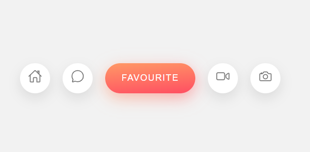

# PROYECTO 9 (Menu animado)

## Captura

pantalla

## Contenido aprendido

- Estructura de carpetas
- flexbox
- implementacion de pseudoelementos css
- reset css
- preprocesador scss
- iconos ionic
